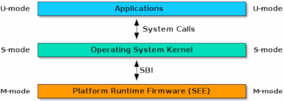

# OpenSBI

As described in the context of [RISC-V](../2_RISCV-on-FPGA/2-1_RISC-V_ISA.md), running an OS on this architecture requires a System Binary Interface (SBI) that implements a layer of abstraction between the Supervisor, in this case the OS, and the low level System Execution Environment (SEE), and allows the OS software to be ported between different RISC-V implementations.  
The below figure depicts the RISC-V privileged architecture, including the Application Binary Interface (ABI) that implements the calling conventions between the Application and the Application Execution Environment (AEE), in this case provided by the OS, and the SBI between the OS and the SEE.

  
(*Source: [RISC-V SBI Specification](https://github.com/riscv/riscv-sbi-doc)*)

The RISC-V SBI consists of the user-level (*U*) and supervisor-level (*S*) ISA together with a set of SBI function calls described in the [RISC-V SBI specification](https://github.com/riscv/riscv-sbi-doc), e.g. to manage hardware threads, set timer interrupts, or perform a system reset, and support for the RISC-V SBI v0.2 has been added to the Linux kernel.  
The reference implementation of the RISC-V SBI is [OpenSBI](https://github.com/riscv/opensbi).
OpenSBI requires an underlying platform-specific firmware running in *M*-mode, that confirms to OpenSBI's static SBI library.  
This library also defines an interface for integrating platform specific operations like console access functions.
The platform-independent SBI library can be compiled with platform-dependent hardware manipulation functions into a platform-specific SBI library, that implements the actual SBI call processing.  
OpenSBI already includes such platform specific examples for a range of platforms, with the Freedom U 540 (that is implemented via the Freedom U SDK described in [2-4_Rocket-Chip](../2_RISCV-on-FPGA/2-4_Rocket-Chip.md)) being one of them.

## (Additional) Resources

[1] RISC-V Open Source Supervisor Binary Interface. <https://github.com/riscv/opensbi>
