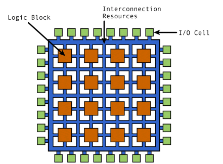
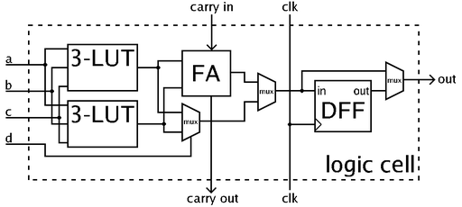
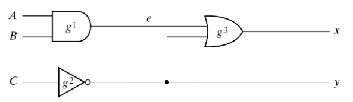

# Field Programmable Gate Arrays

FPGAs essentially consist of a programmable switch matrix with transistors to turn the connection between different lines on and off, and Configurable Logical Blocks (CLBs) that are located between the lines.  
*Note: The different elements of an FPGA do not have a standardised terminology or architecture between the different vendors. Since this project is working with Xilinx FPGAs from the 7-Series, it has to be note that some details might differ for FPGAs for different vendors.*

  
(*Source: [3]*)

CLBs are small programmable state machines that contain the logic of an FPGA. Their major components are the  Lookup-Tables (LUTs), Flip-Flops, and the global clock, which is part of the global interconnect and serves as input for each clocked element.  
LUTs are truth tables to creating arbitrary combinatorial logic functions and  e.g. combining two inputs with an AND gate to one output, whereas Flip-flops maintain the state of the CLB. On each trigger of the clock, e.g. on the rising edge, the Flip-Flops of an FPGA set their output signal to the current input, and maintain this output until the next trigger. This has the effect that the output of the LUTs gets aligned to the squarewave clock signal and it results in the FPGA being driven at a certain frequency.  
The below figure shows an example of such a CLB with two LUTs that each combine 3 inputs to one output (3-LUT), one Full Adder (FA), and a D-type FlipFlop (DFF) that aligns this sum of the adder to the clock-signal.

  
(*Source: [4]*)

The communication with structures outside of the FPGA itself is realized via the I/O blocks, that can be programmed to serve as inputs and outputs and e.g. be wired up with certain periphery.
FPGAs often have a large amount of I/O Blocks, and together with the overall architecture, it has the effect that FPGAs can work massively parallel by doing specific functions every clock cycle directly on the I/O.
Hence, they are often used in systems that are required to process data in real-time with complex algorithms and multiple inputs, e.g. digital signal or image processing.  
The logic that is implemented with an FPGA runs slower that if it was hardwired in an ASIC, because FPGAs run at a lower clock frequency.
Nevertheless, this drawback is in many cases outweighed by the ability to re-program the FPGAs last minute or even when they are already used in field. While historically FPGAs were mainly used for prototyping logic that would later be manufacture as an ASIC, the increasing performance of FPGAs nowadays more and more results in the use of them in production.

Most FPGAs use small static ram for each programming element that is volatile and can not store their internal configuration.
Instead on each power-up, the configuration bitstream has to be loaded into the FPGA again via an external configuration flash memory. This logic is programmed with a Hardware Description Language (HLD) like VHDL or Verilog.  
In contrast to other programming languages like Java or C, HDLs do not describe a program's behaviour, but instead the digital circuit and its behaviour on different levels.
Most literature differs between the high Behaviour Level of abstraction, which is imperative code whose execution is triggered by certain events, the Register Transfer Level (RTL) that describes the data flow between registers, and the Logical Gate Level of abstraction, that defines how the low level components are wired up.

```verilog
module smpl_circuit(A, B, C, x, y);
    input A, B, C;
    output x, y;
    wire e;
    and g1(e, A, B);
    not g2(y, C);
    or g3(x, e, y);
endmodule
```

The above code shows such a gate-level Verilog implementation for a simple circuit on the Logical Gate Level, the actual gate netlist implementation of it would look like the below circuit:  

  
(*Source: [6]*)

The end-to-end synthesis process, starting from HDL up until the bitstream that is used to program the FPGA, is described in the markdown about [Symbiflow - the GCC of FPGAs](symbiflow.md).

## (Additional) Resources

[1] Bob Zeidman. All about FPGAs. *EE Times*. <https://www.eetimes.com/all-about-fpgas/>  
[2] Taylor Roorda. FPGAs 101: A Beginner’s Guide. <www.digikey.com/en/blog/fpgas-101-a-beginners-guide>  
[3] EEVblog. EEVblog 496 - What is An FPGA?  
[4] Wikimedia Commons. FPGA cell example. <https://commons.wikimedia.org/wiki/File:FPGA_cell_example.png>  
[5] An Introduction to the FPGA Design Process. <www.fpgatutorial.com/fpga-design-introduction/>  
[6] ECE232: Hardware Organization University of Massachusetts Amherst and Design. Part 3: Verilog Tutorial. <https://euler.ecs.umass.edu/ece232/pdf/03-verilog-11.pdf>  
[7] Nandland. What is a Flip-Flop? How are they used in FPGAs? <www.youtube.com/watch?v=lrXjuotxqzE>  
[8] The History, Status, and Future of FPGAs. <https://cacm.acm.org/magazines/2020/10/247594-the-history-status-and-future-of-fpgas/fulltext>
