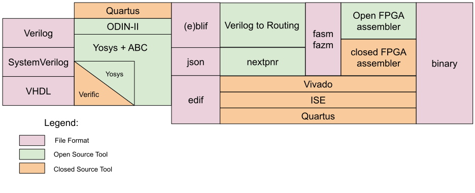
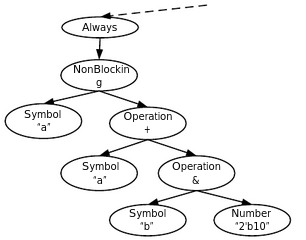
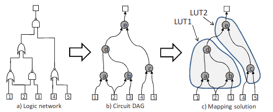

# Symbiflow - "The GCC for FPGAs"

In order to implement the written code on the hardware, the vendors of the FPGAs provide software that compiles the code into a bitstream that then can be loaded to the FPGA. While these tools are convenient to use, they are mostly closed-sourced and often require a licence that either costs money or doesn't include all features, e.g. [Vivado for Xilinx](https://euler.ecs.umass.edu/ece232/pdf/03-verilog-11.pdf) or [Quartus II](www.intel.com/content/www/us/en/software/programmable/quartus-prime/overview.html) for Altera FPGAs.
However, within the recent years more open-source toolchains for this synthesis have emerged, one of them is Symbiflow.  
[Symbiflow](https://symbiflow.github.io) is an umbrella project for different tools, projects and architecture definitions, and can be understood as the "GCC of FPGAs" [1].


(*Source: [1]*)  

Apart from solving the process of RTL synthesis, Symbiflow includes different solutions for technology mapping since FPGAs differ in their architecture not only between the different vendors, but also within the different FPGA families of one vendor. Therefore, the final design has to be described for the platform-specific resource, this description maps the generic form into an equivalent circuit of the basic logical elements of the target FPGA, with information about e.g. LUTs, register, multiplexers and flip-flops.

In order to interpret and optimize the HDL program code, the first step in the synthesize process is the parsing of the code into an Abstract Syntax Tree (AST).

```verilog
req [1:0] a,b;
...
always @(posedge clk)
begin
    a <= a + b & 2'b10;
end
```

The above code for example would be translated in an AST:

  
(*Source: [7]*)

This hierarchical data structure allows to identify different design structures, optimize the logic, and then to parse it into an appropriate netlist that is mapped to a target architecture.  
The necessary specification for the target is required via a separate file or library.
This information can be already provided by the toolchain itself if it includes support for the target, otherwise it has to be added by the user.
Symbiflow uses the [Yosys Framework](www.clifford.at/yosys/) for this, which provides scripts to convert behavioural level Verilog to RTL, logical gate or physical gate level, and [ABC](https://people.eecs.berkeley.edu/~alanmi/abc/), a software system for sequential synthesis and verification of binary sequential logic circuits.  
Alternatively, the Odin-II tool also solves the synthesis and optimization process, and its output Berkeley Logic Interchange Format (BLIF) interfaces well with the Verilog-to-Routing tool described below.

The final output of the synthesis process contains the logical elements of the respective FPGA chip with the specific connections between them, but not the physical layout. To implement the netlist representation on the hardware, the Place and Route (PnR) process is necessary, which requires information about the physical composition of the device.  
PnR includes the action of grouping cells in synthesis output into larger logic cells (which is often referred to as *Packing* or *Clustering*), *Placing* them to the functional blocks of the FPGA and *Routing* the connection between cell ports to the physical wires. The below Figure shows an example on how a logic network can be mapped into two 4-LUTs by first converting the logic into a Directed Acyclic Graph (DAG) and then mapping the DAG onto the LUTs.

  
(*Source: [6]*)

For this process, Symbiflow includes two different projects.  
The [Verilog-to-Routing (VTR)](https://github.com/verilog-to-routing/vtr-verilog-to-routing) project rather focuses on academical research and allows the analysis of theoretical architectures with e.g. graphical visualization, timing constraints and debugging. [Nextpnr](https://github.com/YosysHQ/nextpnr) on the other hand targets commercial FPGAs and already includes support for some Lattice devices, with additional work in progress towards support for Xilinx.  
The results of the PnR process is written into an FPGA ASM (FASM) file.  This file does not contain the bitstream that is used to flash the FPGA, but instead it specifies "Features" that are enabled or disabled in the actual bitstream, by setting or clearing certain bits.

The last step of the FPGA design flow is the translation of that FASM file into a format that can be understood by the FPGAs. The necessary architecture and bitstream format documentation for this is also part of the Symbiflow repository with  dedicated projects for the different FPGA vendors and series e.g. [Project X-Ray](https://github.com/SymbiFlow/prjxray) for the Xilinx 7-Series FPGA.
This enables building the bitstream that then can be loaded to the FPGA.
The loading is done either with the vendors software like Vivado, or the [xc3sprog](https://github.com/matrix-io/xc3sprog) tool, which is a suit of utilities that allows the programming of FPGAs directly from the console.

## (Additional) Resources

[1] Symbiflow. <https://symbiflow.readthedocs.io>  
[2] SymbiFlow examples. <https://github.com/SymbiFlow/symbiflow-examples>  
[3] Clifford Wolf. Yosys Open SYnthesis Suit. <www.clifford.at/yosys/>  
[4] nextpnr. <https://github.com/YosysHQ/nextpnr>  
[5] Verilog to Routing. <https://github.com/verilog-to-routing/vtr-verilog-to-routing>  
[6] Computer-Aided Design for FPGAs: Overview and Recent Research Trends. <https://janders.eecg.utoronto.ca/pdfs/chap.pdf>  
[7] ABC: A System for Sequential Synthesis and Verification. <https://people.eecs.berkeley.edu/~alanmi/abc/>  
[8] Project X-Ray. <https://github.com/SymbiFlow/prjxray>  
[9] Odin II. <https://docs.verilogtorouting.org/en/latest/odin/>
