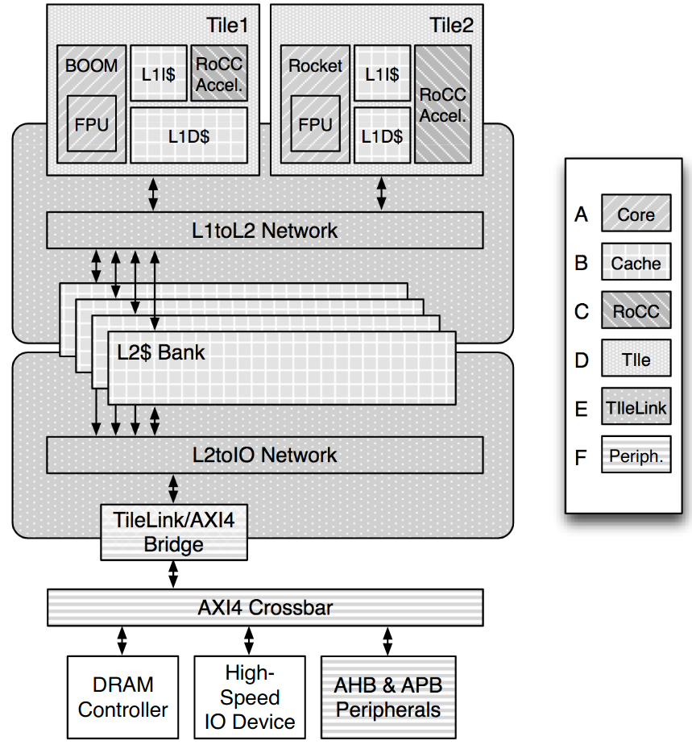

# The Rocket Chip Generator

The Rocket Chip Generator implements a System-on-Chip aounrd the Rocket Core RISC-V Soft-CPU.
It was originally developed and published by the Electrical Engineering and Computer Science Department at UC Berkeley.
It is not a single instance of an SoC design, but instead implements a "plug-and-play environment" by providing libraries with generators for the different components, that can be connected via standardized interfaces.  
The Rocket Core supports the RV32G and RV64G ISA, the latter is an important difference to the [VexRiscv CPU](2-2_VexRiscv_Soft-CPU.md) that only implements the 32-bit ISA.
While per default the Rocket Core is used as CPU, the generator also includes the Berkeley Out-of-Order (BOOM) Core, which is a RV64G core generator for education purposes, and additionally allows to implement and use a custom CPU generator.
Additionally, the project includes configurable generators for caches, and the Rocket Custom Coprocessor (RoCC) template that allows the implementation of application-specific coprocessors like accelerators for cryptographic functions.
The described components are grouped together into a Tile, one system may implement multiple tiles and thus multiple cores.  
The below figure shows a SoC with two example tiles that use different cores, each tile with an instruction and a data cache, and a RoCC-compatible coprocessor. For both cores, the Rocket Chip Generator provides the option to also include an FPU.
  
(*Source: [UCB/EECS-2016-17](https://www2.eecs.berkeley.edu/Pubs/TechRpts/2016/EECS-2016-17.html)*)

## Freedom Platform

Using the Rocket Chip Generator, the SiFive company, which was founded by UC Berkely Professors to commercially distribute RISC-V processors and IPs, implemented the [Freedom E SDK](https://github.com/sifive/freedom-e-sdk), and the [Freedom Unleashed SDK (Freedom U SDK)](https://github.com/sifive/freedom-u-sdk).
Since the source files are published on GitHub under the Apache-2.0 Licence, they can be used to easily implemented the Rocket Core if one of the boards with a supported revision is owned.
This is of relevance because one of the platforms that is implemented with the Freedom E SKD, the [Freedom E310](https://github.com/sifive/freedom), is designed to be mapped on the Xilinx Arty A7 development board.
The practical implementation of this is described in [Hardware/2_Xilinx_Arty-A7](documentation/Hardware/2_Xilinx_Arty-A7).

The Freedom E SDK is a library that provides scripts and configuration for using the SiFive [Freedom Metal](https://github.com/sifive/freedom-metal) library, which "enables portable, bare-metal application development for all of SiFive’s RISC-V IP, FPGA evaluation targets, and development boards."([ref](https://github.com/sifive/freedom-metal)).
This means that it allows to run embedded software, and to port OS systems to RISC-V by using Freedom Metal as Hardware Abstraction Layer.
While the E SDK targets embedded applications, the Freedom U SDK allows to build disk images, bootloader binaries and Linux kernel images either on the SiFive Unleashed / Unmatched development boards, or on the QEMU simulations of them.  
Analogous to the E310 for the Arty, SiFive also provides the source files for its Freedom U500 platform, but this targets the [Xilinx Virtex-7 FPGA VC707 Evaluation Kit](www.xilinx.com/products/boards-and-kits/ek-v7-vc707-g.html#hardware) instead of the Arty. The reason for this is according to the developers of the Freedom project, that "the U500 designs are rather too large to fit in the Arty, especially now that a standard linux system expects an FPU" ([ref](https://github.com/sifive/freedom/issues/1#issuecomment-341855550)). While the Virtex-7 FPGA includes 528,720 logical cells, the Artix-7 FPGA that is used in the Arty only contains 33,280.

## (Additional) Resources

[1] The Rocket Chip Generator. <https://people.eecs.berkeley.edu/~krste/papers/EECS-2016-17.pdf>  
[2] SiFive Freedom. <https://github.com/sifive/freedom>  
[3] SiFive Freedom Unleashed SDK. <https://github.com/sifive/freedom-u-sdk>  
[4] SiFive Freedom E SDK. <https://github.com/sifive/freedom-e-sdk>  
[5] SiFive Freedom Metal. <https://github.com/sifive/freedom-metal>
[6] SiFive OpenEmbedded Layer. <https://github.com/sifive/meta-sifive>
