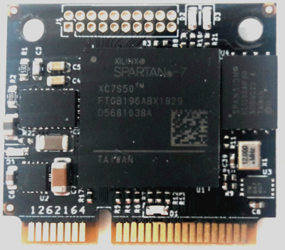

# IOTA Crypto Core

The [IOTA CryptoCore](https://ecosystem.iota.org/projects/iota-crypto-core-fpg) (ICCFPGA) is a hardware module that was "designed for applications that need fast, dedicated proof of work and a secure memory" [2].
The full source code of the ICCFPGA project is published on the [iccfpga-rv repository](https://gitlab.com/iccfpga-rv), and already provides a [VexRiscv](../../FPGA/2_RISCV-on-FPGA/2-2_VexRiscv_Soft-CPU.md) Soft CPU implementation specifically for the ICCFPGA, with additional scripts to upload that core to the FPGA from a connected Raspberry Pi.  
The aim for the work with the ICCFPGA was to build upon the existing VexRiscv core and implement a Linux kernel by adjusting the existing [Linux-on-LiteX-VexRiscv](../../FPGA/3_Linux-on-RISCV/README.md) project.
In the long run, the plan was also to use the [ATECC608A](www.microchip.com/wwwproducts/en/ATECC608A) secure element that is included in the ICCFPGA, to securely store the keypair that is used for the encrypting the network, and potentially expand on the security aspect of the Peer-to-Peer network.  

## Technical Description

The ICCFPGA consists of the FPGA module, which is an generic [Xilinx Spartan 7 Series FPGA](https://www.xilinx.com/products/silicon-devices/fpga/spartan-7.html) with 16MB flash for configuration, different GPIO pins, and JTAG connection. Apart from that, it includes an [ATECC608A](www.microchip.com/wwwproducts/en/ATECC608A) secure element that employs hardware-based cryptographic key storage and cryptographic countermeasures, and hardware accelerators for proofs of work.
It uses a mini-PCIe connector with custom signals on the connector, that is shown in Figure with the FPGA placed in the center, and the ATECC608A is visible at the right side of the FPGA:
  
In addition to the mini-PCIe *iccfpga*, a development board *iccfpga-dev* was manufactured with a socket for the iccfpga. This board can be used standalone as well as that it can serve as a "Hat" for a Raspberry Pi 3/4, with JTAG and UART from the Raspberry PI to the iccfpga-dev for flashing and debugging the FPGA.
The iccfpga-dev board on top has a socket for the iccfpga module, and a Raspberry Pi 3/4 compatible connector that can be connected with the GPIO pins of a Raspberry Pi below:
  

In regards to the P2P network, using the development board together with a Raspberry Pi could have enabled Internet connection by configuring the Raspberry Pi to forward the traffic from the ICCFPGA UART to the network.

**As described in the [Used-Hardware/README](../README.md), the ICCFPGA is not suited to run an OS, which is required for using the Rust Standard Library. It was only used to test a [baremetal Rust programm](hello-baremetal-world). The [Xilinx Arty A7](../2_Xilinx_Arty-A7) was used instead.**

## (Additional) Resources

[1] Thomas Pototschnig. IOTA Ecosystem Project - IOTA Crypto Core FPGA. <https://ecosystem.iota.org/projects/iota-crypto-core-fpga>  
[2] Thomas Pototschnig. CryptoCore Manual. <https://gitlab.com/iccfpga-rv/iccfpga-manual>  
[3] iccfpga-rv. <https://gitlab.com/iccfpga-rv>
