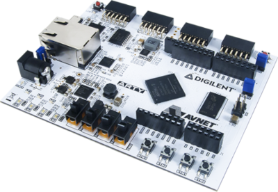

# Xilinx Arty A7-35T FPGA development board

  

(*Source: [1]*)

The Xilinx Arty A7-35T ("Arty") is a common FPGA development board that can be programmed via USB over the USB-JTAG programming circuitry and includes 256MB DDR3L memory, Pmod connectors to extend the board and other peripherals.
It is among the supported boards of the [Symbiflow toolchain](documentation/FPGAs/1_General/1-2_symbiflow-toolchain.md), and the counter-test program of the [Symbiflow-examples](https://github.com/SymbiFlow/symbiflow-examples) was successfully loaded to the board.
However, despite the attempt for transparency, the practical work on the Arty that is described below eventually still used the closed-source tool Vivado for testing, in order to prevent complications.

For the SoC on the FPGA, the [Linux-on-Litex-VexRiscv](documentation/FPGAs/3_Linux-on-RISCV/Linux-on-LiteX-VexRiscv.md) project was tested first.
Since it already provides support for the Arty, the FPGA bitstream of the Vexriscv-Core, and the Linux and OpenSBI Images could be easily loaded to the board. A lxterm shell was used to interact with the system to configure internet access over Ethernet between board and a host computer.
The instructions for this are provided in [connect-host](documentation/Hardware/2_Xilinx_Arty-A7/connect-host).
It was used to transfer files from host computer to board by setting up a TFTP Server on the host laptop and querying it from the board.
This allowed copying the compiled Rust ELF executable of the P2P-Network to the board.
But as described in the [Used-Hardware/README](documentation/README.md), executing the binary was not successful.

In the following work, it was attempted to implement one of the SoCs that include a 64-bit Rocket Core on the Arty.
The first considered project for this was [Linux-on-Litex-Rocket](documentation/FPGAs/3_Linux-on-RISCV/Linux-on-Litex-Rocket.md), that also leverages LiteX to build the SoC, but uses the Rocket Chip as core instead of VexRiscv. This project already supports a few boards, but adding support for a new one would have required to delve into the details of LiteX, which did not fit into the scope of the work at this point. That being said, the project holds potential for future work, and the task of adding support for a new board offers a good entry point into the whole LiteX ecosystem.

Apart from that, the Freedom Platform (described in the [Markdown about the Rocket Generator](documentation/FPGAs/2_RISCV-on-FPGA/2-4_Rocket-Chip.md)) also presents the option of building on the E310 platform that already supports the Arty, but this also only facilitates baremetal applications.
However, during the course of this work, the GitHub repository that provides the source files for the Freedom E310 and U500 has been marked as archived because it is no longer actively maintained, and not up to data with the FPGA board revisions, software ecosystems and other dependency changes.
Effectively, it failed to load the compiled Freedom E310 Arty FPGA Dev Kit with Vivado to the hardware, when following the instructions from the manual.
The reason for this is that the platform was designed for an older revision of the Arty board, that uses a different memory model `mt25ql128`.
When using the current memory model `s25fl128sxxxxxx0`, Vivado successfully loads the compiled firmware to the board, but the LEDs are not blinking like their supposed to. Thus it is quite likely that there have been other changes between the different board revisions that cause either the program, or, more likely, the SoC implementation to fail.

**Any further attempts on using the Arty have not been made yet.**

## (Additional) Resources

[1] Arty A7 Reference Manual. <https://reference.digilentinc.com/reference/programmable-logic/arty-a7/reference-manual>
